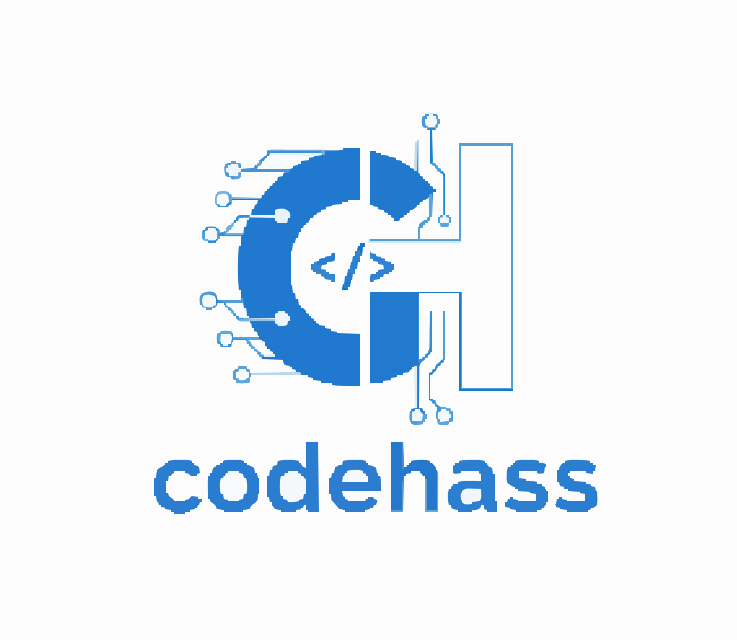

<a name="readme-top"></a>

<div align="center">

  <br/>
</div>

# 📗 Table of Contents

- [📖 About the Project](#about-project)
  - [🛠 Built With](#built-with)
    - [Tech Stack](#tech-stack)
    - [Key Features](#key-features)
  - [🚀 Live Demo](#live-demo)
- [💻 Getting Started](#getting-started)
  - [Prerequisites](#prerequisites)
  - [Setup](#setup)
  - [Install](#install)
  - [Configuration](#configuration)
  - [Usage](#usage)
  - [API Endpoints](#api-endpoints)
- [👥 Authors](#authors)
- [🔭 Future Features](#future-features)
- [🤝 Contributing](#contributing)
- [⭐️ Show your support](#support)
- [📝 License](#license)

# 📖 IT Support RAG Assistant <a name="about-project"></a>

**IT Support RAG Assistant** is a powerful API designed to automate IT support queries using Retrieval-Augmented Generation (RAG). It combines the power of Large Language Models (Google Gemini) with a local knowledge base (ChromaDB) to provide accurate, context-aware answers to user questions.

The system features robust authentication, query history tracking, automatic query clustering using machine learning, and comprehensive experiment tracking with MLflow.

## 🛠 Built With <a name="built-with"></a>

### Tech Stack <a name="tech-stack"></a>

  <ul>
    <li><a href="https://fastapi.tiangolo.com/">FastAPI</a> - Modern, high-performance web framework for building APIs.</li>
    <li><a href="https://www.postgresql.org/">PostgreSQL</a> - Advanced open-source relational database.</li>
    <li><a href="https://www.sqlalchemy.org/">SQLAlchemy</a> - The Python SQL Toolkit and Object Relational Mapper.</li>
    <li><a href="https://python.langchain.com/">LangChain</a> - Framework for developing applications powered by LLMs.</li>
    <li><a href="https://www.trychroma.com/">ChromaDB</a> - AI-native open-source vector database.</li>
    <li><a href="https://mlflow.org/">MLflow</a> - Open source platform for the machine learning lifecycle.</li>
    <li><a href="https://deepmind.google/technologies/gemini/">Google Gemini</a> - Generative AI models.</li>
    <li><a href="https://huggingface.co/">Hugging Face</a> - Platform for ML models (Embeddings).</li>
  </ul>

### Key Features <a name="key-features"></a>

- **🔐 Secure Authentication**: User registration and login with JWT-based authentication stored in HTTP-only cookies.
- **🤖 RAG-Powered QA**: Retrieval-Augmented Generation pipeline to answer support queries using your knowledge base.
- **📦 Query Clustering**: Automatic clustering of user queries to categorize support topics using a trained ML model.
- **📊 Experiment Tracking**: Full integration with MLflow to track RAG metrics (latency, number of chunks) and query results.
- **📜 History Management**: Retrieve past user queries and generated answers.
- **🐳 Dockerized**: Container-ready application with Dockerfile included.

<p align="right">(<a href="#readme-top">back to top</a>)</p>

## 🚀 Live Demo <a name="live-demo"></a>

- [Live Demo Link](link to deployed project)

<p align="right">(<a href="#readme-top">back to top</a>)</p>

## 💻 Getting Started <a name="getting-started"></a>

To get a local copy up and running, follow these steps.

### Prerequisites

- Python 3.10+
- PostgreSQL
- Docker (optional)

### Setup

Clone this repository to your desired folder:

```sh
  git clone https://github.com/codehass/it-support-rag-assistant.git
```

### Install

1. Create a virtual environment:

   ```sh
   python3 -m venv venv
   source venv/bin/activate  # On Windows use: venv\Scripts\activate
   ```

2. Install dependencies:
   ```sh
   pip install -r requirements.txt
   ```

### Configuration

Create a `.env` file in the root directory and add your environment variables. You can copy `.env.example` as a template:

```sh
  cp .env.example .env
```

**Required `.env` Variables:**

```env
USER_DB=postgres
PASSWORD=your_password
DATABASE_HOST=localhost
PORT=5432
DATABASE=your_database_name

# HuggingFace & Google API
HF_TOKEN=your_huggingface_token_here
GOOGLE_API_KEY=your_google_api_key_here

# Authentication
SECRET_KEY=your_secure_secret
ALGORITHM=HS256
ACCESS_TOKEN_EXPIRE_MINUTES=30

FRONTEND_URL=http://localhost:3000
```

### Usage

1. **Start the Database**: Ensure your PostgreSQL service is running and the database is created.

2. **Run the API**:

   ```sh
   uvicorn app.main:app --reload
   ```

   The API will be available at `http://localhost:8000`.

3. **Explore Documentation**:
   Go to `http://localhost:8000/docs` for the interactive Swagger UI.

4. **Start MLflow UI** (Optional, for tracking):
   ```sh
   mlflow ui
   ```
   Access MLflow dashboard at `http://localhost:5000`.

### API Endpoints

**Authentication**

- `POST /api/v1/auth/register` - Register a new user
- `POST /api/v1/auth/login` - Login to get access token (cookie)
- `POST /api/v1/auth/logout` - Logout user
- `GET /api/v1/auth/users/me` - Get current user info

**RAG Support**

- `POST /api/v1/rag/query` - Ask a question to the IT Support Assistant
- `GET /api/v1/rag/history` - Get your query history
- `GET /api/v1/rag/health` - Check backend health status

<p align="right">(<a href="#readme-top">back to top</a>)</p>

## 👥 Authors <a name="authors"></a>

👤 **Hassan El Ouardy**

- GitHub: [@codehass](https://github.com/codehass)
- Twitter: [@hassanelourdy](https://twitter.com/hassanelourdy)
- LinkedIn: [@hassanelourdy](https://www.linkedin.com/in/hassanelouardy/)

<p align="right">(<a href="#readme-top">back to top</a>)</p>

## 🔭 Future Features <a name="future-features"></a>

- [ ] **Voice Interface**: Enable voice-to-text for querying.
- [ ] **Admin Dashboard**: Analytics view for IT support managers.
- [ ] **Feedback Loop**: User feedback mechanism to improve RAG accuracy.

<p align="right">(<a href="#readme-top">back to top</a>)</p>

## 🤝 Contributing <a name="contributing"></a>

Contributions, issues, and feature requests are welcome!

Feel free to check the [issues page](https://github.com/codehass/it-support-rag-assistant/issues).

<p align="right">(<a href="#readme-top">back to top</a>)</p>

## ⭐️ Show your support <a name="support"></a>

If this project helps you, give it a ⭐️!

<p align="right">(<a href="#readme-top">back to top</a>)</p>

## 📝 License <a name="license"></a>

This project is [MIT](./MIT.md) licensed.

<p align="right">(<a href="#readme-top">back to top</a>)</p>
